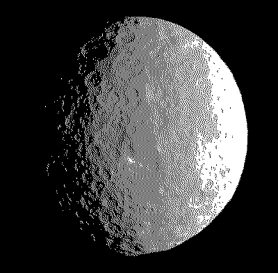

# Ceres

A (very experimental) GameBoy/Color emulator written in rust.

## Build

### Required

- A C compiler
- [RGBDS toolchain](https://rgbds.gbdev.io/)
- [Nightly Rust compiler](https://rust-lang.github.io/rustup/concepts/channels.html).

### Steps

1. Build the bootroms: `cd ceres_core/bootroms && make && cd ../../`
2. Build the emulator: `cargo build`

## Run

To run a given `rom.gb` just type `cargo run rom.gb`.
To see usage of the program: `cargo run -- --help`.

## Platforms

We use SDL and OpenGL so the emulator should be compatible with almost anything,
with maybe a bit of massaging.

## Keys

| Gameboy | Emulator  |
| ------- | --------- |
| Dpad    | WASD      |
| A       | K         |
| B       | L         |
| Start   | Return    |
| Select  | Backspace |

## Thanks

### Documentation

- [Pan Docs](https://gbdev.io/pandocs/)
- [Gameboy Development Wiki](https://gbdev.gg8.se/wiki/articles/Main_Page)
- [Gameboy Bootstrap ROM](https://gbdev.gg8.se/wiki/articles/Gameboy_Bootstrap_ROM#Contents_of_the_ROM)

### Tests

- [Game Boy Test Roms](https://github.com/c-sp/gameboy-test-roms)

### Reference

- [retrio/gb](https://github.com/retrio/gb)
- [Mooneye GB](https://github.com/Gekkio/mooneye-gb)
- [GoBoy](https://github.com/Humpheh/goboy)
- [Gameboy Emulator in C# 8](https://github.com/DaveTCode/gameboy-emulator-dotnet)
- [SameBoy](https://github.com/LIJI32/SameBoy)
